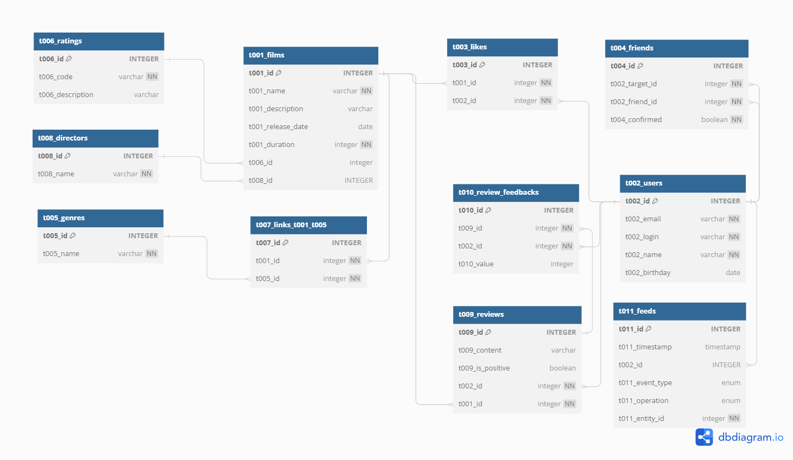

# java-filmorate
Template repository for Filmorate project.

Ссылка на схему БД: [https://dbdiagram.io/d/64df58ca02bd1c4a5e012eb0](https://dbdiagram.io/d/64df58ca02bd1c4a5e012eb0)

Пояснения к схеме:
1. Все таблицы снабжены префиксами вида t[xxx]. Это упрощает формирование псевдонимов таблиц - в качестве псевдонимов удобно использовать эти префиксы.
2. Префиксы полей таблицы совпадают с префиксами таблицы, за исключением случая, когда поле является внешним ключом - в таком случае его имя совпадает с именем первичного ключа таблицы, на который ссылается внешний ключ. Таким образом, соединение идёт по одноимённым полям разных таблиц, а внешние ключи отличаются от иных полей.
3. В случае, если одна таблица имеет несколько внешних ключей на другую таблицу, они также имеют префикс этой второй таблицы, но при этом в их именах есть отличительная часть. Пример - поля t002_target_id и t002_friend_id таблицы t004_friends.
